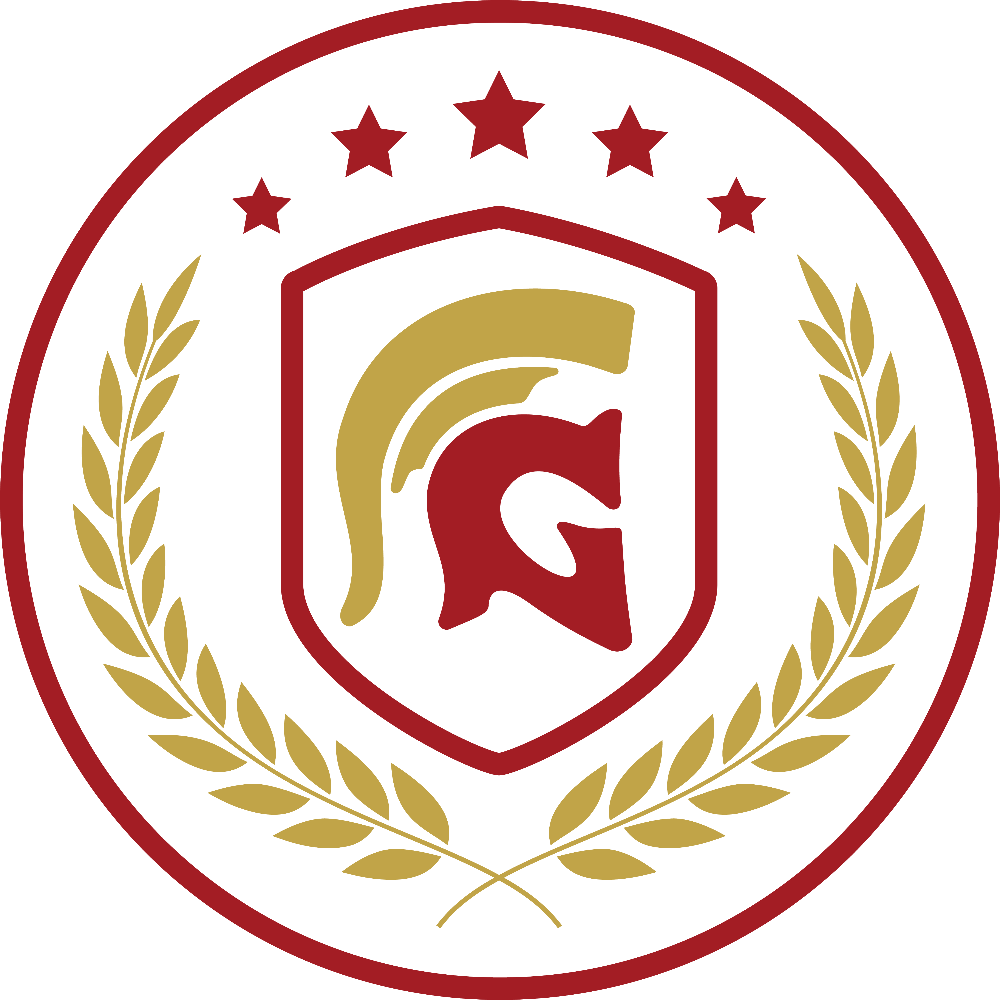

# 🚀 Gandiwa Shortcuts

<div align="center">



**A beautiful, minimal Chrome extension for managing bookmarks with productivity features.**

[](https://chrome.google.com)
[](LICENSE)
[](manifest.json)

[✨ Features](#-features) • [📸 Screenshots](#-screenshots) • [🔧 Installation](#-installation) • [📖 Documentation](#-documentation)

</div>

---

## ✨ Features

### 🔖 Smart Bookmark Manager

- **Quick Links** - Create custom bookmark categories with drag & drop reordering
- **Chrome Bookmarks Integration** - Access native Chrome bookmarks from sidebar
- **Auto Favicon** - Automatically fetch website icons using Google Favicon API
- **Custom Icons** - Set custom icon URLs for any bookmark

### ⏱️ Focus Timer (Pomodoro)

- Customizable timer duration (default 25 minutes)
- Beautiful notification with blur overlay when complete
- Browser notification with sound alert
- Animated marquee in tab title

### 📝 Private Notes

- Quick notes widget in right sidebar
- Auto-save to local storage
- Monospace font (JetBrains Mono) for code snippets

### 🎨 Premium UI/UX

- **Dark/Light Mode** - Toggle with one click
- **Glassmorphism Design** - Modern frosted glass aesthetic
- **Smooth Animations** - Micro-interactions and transitions
- **Masonry Layout** - Pinterest-style 2-column grid
- **Responsive Sidebars** - Collapsible left and right panels

---

## 📸 Screenshots

<div align="center">

### Dark Mode


### Light Mode


### Focus Timer Complete


</div>

---

## 🔧 Installation

### From Source (Developer Mode)

1. **Clone the repository**

   ```bash
   git clone https://github.com/yourusername/gandiwa-shortcuts.git
   ```

2. **Open Chrome Extensions**
   - Navigate to `chrome://extensions/`
   - Enable **Developer mode** (toggle in top right)

3. **Load the extension**
   - Click **"Load unpacked"**
   - Select the `gandiwa-shortcuts` folder

4. **Open a new tab** to start using Gandiwa Shortcuts! 🎉

---

## 📖 Documentation

See [aplikasi.md](aplikasi.md) for detailed documentation in Bahasa Indonesia.

### Project Structure

```
gandiwa-shortcuts/
├── manifest.json           # Chrome extension config
├── newtab.html            # Main page
├── logo.png               # Extension logo
├── README.md              # This file
├── aplikasi.md            # Indonesian documentation
│
└── app/
    ├── js/
    │   ├── app.js         # Main application logic
    │   ├── renderer.js    # Chrome bookmarks renderer
    │   ├── state.js       # State management
    │   └── storage.js     # Chrome storage wrapper
    │
    ├── css/
    │   ├── variables.css  # CSS custom properties
    │   ├── layout.css     # Grid & flexbox layouts
    │   ├── components.css # UI components
    │   ├── sidebar.css    # Sidebar styles
    │   └── animations.css # Keyframes
    │
    └── assets/
        ├── favicon.webp   # Tab favicon
        └── focus-alert.wav # Timer sound
```

---

## ✅ Pros & Cons

### ✅ Kelebihan (Pros)

| Feature                     | Description                               |
| --------------------------- | ----------------------------------------- |
| 🚀 **Fast & Lightweight**   | No external dependencies, pure vanilla JS |
| 🔒 **Privacy First**        | All data stored locally, no cloud sync    |
| 🎨 **Beautiful UI**         | Premium glassmorphism design              |
| 🔖 **Drag & Drop**          | Intuitive bookmark organization           |
| ⏱️ **Built-in Focus Timer** | Pomodoro productivity feature             |
| 🌙 **Dark/Light Mode**      | Eye-friendly theme options                |
| 📱 **Responsive**           | Works on all screen sizes                 |

### ❌ Kekurangan (Cons)

| Limitation            | Description                           |
| --------------------- | ------------------------------------- |
| 🔄 **No Cloud Sync**  | Data only on local device             |
| 🌐 **Chrome Only**    | Not available for Firefox/Safari      |
| 📦 **Manual Install** | Not yet on Chrome Web Store           |
| 🔍 **No Search**      | Cannot search bookmarks (coming soon) |

---

## 🛠️ Tech Stack

- **HTML5** - Semantic markup
- **CSS3** - Custom properties, Flexbox, Grid, Animations
- **JavaScript (ES6+)** - Vanilla JS, no frameworks
- **Chrome Extension APIs** - Storage, Bookmarks, Notifications

---

## 🤝 Contributing

Contributions are welcome! Please feel free to submit a Pull Request.

1. Fork the project
2. Create your feature branch (`git checkout -b feature/AmazingFeature`)
3. Commit your changes (`git commit -m 'Add some AmazingFeature'`)
4. Push to the branch (`git push origin feature/AmazingFeature`)
5. Open a Pull Request

---

## 📄 License

This project is licensed under the MIT License - see the [LICENSE](LICENSE) file for details.

---

## 🙏 Acknowledgments

- Google Favicon API for automatic icon fetching
- JetBrains Mono font for the notes widget
- Icons inspired by Feather Icons

---

<div align="center">

**Made with ❤️ by Gandiwa Team**

⭐ Star this repo if you find it useful!

</div>
